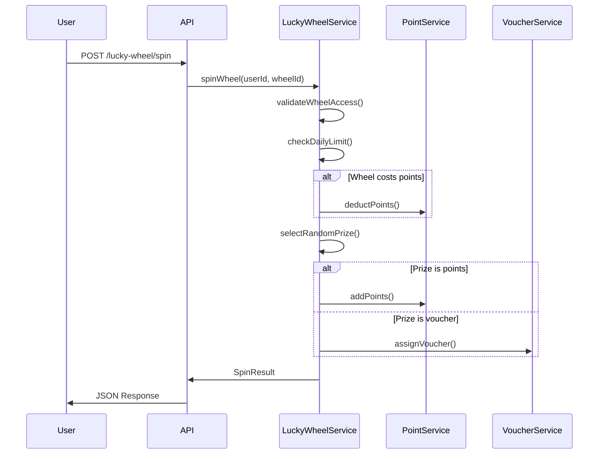

# 🎰 Hệ thống Vòng Quay May Mắn (Lucky Wheel System)

## 📋 Tổng quan

Hệ thống vòng quay may mắn được tích hợp hoàn toàn vào PhotoGo backend, cho phép người dùng tham gia các trò chơi may mắn để nhận các phần thưởng khác nhau như điểm thưởng, voucher, và tiền mặt.

## 🏗️ Kiến trúc Hệ thống

### Core Entities

1. **LuckyWheel** - Cấu hình vòng quay
2. **LuckyWheelPrize** - Phần thưởng trong vòng quay  
3. **LuckyWheelSpin** - Lịch sử quay của người dùng

### Tích hợp với các Module hiện có

- **Points System**: Trả phí quay và nhận điểm thưởng
- **Vouchers System**: Phần thưởng voucher
- **Campaign System**: Vòng quay theo campaign

## 🎯 Tính năng chính

### 🎮 Loại Vòng Quay
- **FREE**: Vòng quay miễn phí
- **POINTS**: Trả điểm để quay
- **CAMPAIGN**: Vòng quay trong campaign

### 🎁 Loại Phần Thưởng
- **POINTS**: Điểm thưởng
- **VOUCHER**: Voucher giảm giá
- **EMPTY**: Không trúng gì

### ⚡ Smart Features
- Xác suất trúng thưởng có thể cấu hình
- Giới hạn số lần quay hàng ngày
- Quản lý số lượng phần thưởng
- Tích hợp với campaign
- Hoàn trả điểm khi có lỗi

## 🗃️ Database Schema

### Bảng `lucky_wheel`
```sql
- id: UUID (Primary Key)
- name: VARCHAR(255) - Tên vòng quay
- description: TEXT - Mô tả
- type: ENUM('free', 'points', 'campaign') - Loại vòng quay
- cost_points: INTEGER - Số điểm cần để quay
- daily_spin_limit: INTEGER - Giới hạn lượt quay/ngày
- status: ENUM('active', 'inactive', 'scheduled') - Trạng thái
- start_date: DATE - Ngày bắt đầu
- end_date: DATE - Ngày kết thúc
- campaign_id: UUID - Liên kết campaign (optional)
```

### Bảng `lucky_wheel_prize`
```sql
- id: UUID (Primary Key)
- wheel_id: UUID - ID vòng quay
- name: VARCHAR(255) - Tên phần thưởng
- type: ENUM('points', 'voucher', 'empty') - Loại thưởng
- points_value: INTEGER - Giá trị điểm
- voucher_id: UUID - ID voucher
- probability: DECIMAL(5,2) - Xác suất trúng (%)
- max_quantity: INTEGER - Số lượng tối đa (-1 = vô hạn)
- used_quantity: INTEGER - Số lượng đã dùng
- color: VARCHAR(10) - Màu hiển thị
- icon_url: TEXT - URL icon
```

### Bảng `lucky_wheel_spin`
```sql
- id: UUID (Primary Key)  
- user_id: UUID - ID người dùng
- wheel_id: UUID - ID vòng quay
- prize_id: UUID - ID phần thưởng trúng
- cost_points: INTEGER - Điểm đã trả
- status: ENUM('pending', 'completed', 'failed', 'cancelled')
- result_description: TEXT - Mô tả kết quả
- spin_angle: DECIMAL(5,2) - Góc quay
- point_transaction_id: UUID - ID giao dịch trừ điểm
- reward_point_transaction_id: UUID - ID giao dịch cộng điểm thưởng
- voucher_user_id: VARCHAR(100) - ID voucher được tặng
```

## 🔧 Setup và Cài đặt

### 1. Tạo Database Tables
```bash
# Chạy script SQL để tạo tables
psql -d your_database -f create-lucky-wheel-tables.sql
```

### 2. Import Module
Module đã được tự động import vào `app.module.ts`:
```typescript
import { LuckyWheelModule } from './modules/lucky-wheel/lucky-wheel.module';
```

### 3. Dependencies
Hệ thống sử dụng các module có sẵn:
- PointModule
- VoucherModule  
- CampaignModule
- AuthModule

## 📡 API Endpoints

### 👤 User Endpoints

#### Lấy danh sách vòng quay hoạt động
```http
GET /lucky-wheel/wheels
Content-Type: application/json
```

#### Lấy chi tiết vòng quay
```http
GET /lucky-wheel/wheels/{wheelId}
Content-Type: application/json
```

#### Quay vòng may mắn
```http
POST /lucky-wheel/spin
Authorization: Bearer {token}
Content-Type: application/json

{
  "wheel_id": "uuid-string"
}
```

#### Lấy lịch sử quay
```http
GET /lucky-wheel/my-spins?current=1&pageSize=10&wheel_id=uuid
Authorization: Bearer {token}
```

#### Kiểm tra số lượt quay hôm nay
```http
GET /lucky-wheel/my-spins/today-count/{wheelId}
Authorization: Bearer {token}
```

### 🔑 Admin Endpoints

#### Tạo vòng quay mới
```http
POST /lucky-wheel/admin/wheels
Authorization: Bearer {admin-token}
Content-Type: application/json

{
  "name": "Vòng quay hàng ngày",
  "description": "Vòng quay miễn phí mỗi ngày",
  "type": "free",
  "cost_points": 0,
  "daily_spin_limit": 1,
  "status": "active"
}
```

#### Tạo phần thưởng
```http
POST /lucky-wheel/admin/prizes
Authorization: Bearer {admin-token}
Content-Type: application/json

{
  "wheel_id": "uuid-string",
  "name": "100 điểm",
  "type": "points",
  "points_value": 100,
  "probability": 25.0,
  "color": "#4CAF50"
}
```

#### Lấy thống kê vòng quay
```http
GET /lucky-wheel/admin/wheels/{wheelId}/statistics
Authorization: Bearer {admin-token}
```

## 🎯 Workflow Hệ thống

### 1. Spin Process


### 2. Prize Selection Algorithm
```typescript
// Thuật toán chọn phần thưởng
1. Lấy tất cả prizes active của wheel
2. Filter ra những prize đã hết số lượng
3. Generate số random 0-100
4. Duyệt qua các prizes theo xác suất tích lũy:
   - Nếu random <= cumulativeProbability: trúng prize này
   - Ngược lại: tiếp tục với prize tiếp theo
5. Cập nhật used_quantity nếu có giới hạn
```

## 🧪 Testing

### Test Data Creation
```sql
-- Tạo vòng quay test
INSERT INTO lucky_wheel (name, type, daily_spin_limit) VALUES
('Test Wheel', 'free', 5);

-- Tạo prizes test
INSERT INTO lucky_wheel_prize (wheel_id, name, type, points_value, probability) VALUES
((SELECT id FROM lucky_wheel WHERE name = 'Test Wheel'), '50 Points', 'points', 50, 30.0),
((SELECT id FROM lucky_wheel WHERE name = 'Test Wheel'), '100 Points', 'points', 100, 20.0),
((SELECT id FROM lucky_wheel WHERE name = 'Test Wheel'), 'No Prize', 'empty', NULL, 50.0);
```

### API Testing với curl
```bash
# Test spin wheel
curl -X POST http://localhost:3000/lucky-wheel/spin \
  -H "Authorization: Bearer YOUR_TOKEN" \
  -H "Content-Type: application/json" \
  -d '{"wheel_id": "your-wheel-id"}'

# Test get active wheels
curl -X GET http://localhost:3000/lucky-wheel/wheels
```

## 📊 Monitoring và Thống kê

### Admin Statistics
- Tổng số lượt quay
- Phân bố phần thưởng đã trúng
- Tỷ lệ chuyển đổi user
- Revenue từ paid spins

### User Analytics
- Lịch sử quay cá nhân
- Tổng phần thưởng đã nhận
- Streak quay hàng ngày

## 🔒 Security Features

### Validation
- Kiểm tra quyền truy cập vòng quay
- Validate daily spin limits
- Check user balance trước khi deduct points
- Verify wheel active status và time range

### Error Handling
- Auto-refund points khi có lỗi
- Graceful handling của external service failures
- Transaction rollback mechanism

## 🚀 Production Considerations

### Performance
- Database indexes được tối ưu
- Caching cho active wheels
- Bulk operations cho admin actions

### Scalability
- Horizontal scaling ready
- Queue system cho high-volume operations
- Database sharding support

### Monitoring
- Metrics cho spin success rate
- Alerting cho unusual patterns
- Performance monitoring

## 📝 Changelog

### Version 1.0.0
- ✅ Core lucky wheel functionality
- ✅ Points, voucher, cash rewards integration
- ✅ Admin management interface
- ✅ User daily limits
- ✅ Campaign integration ready
- ✅ Comprehensive error handling
- ✅ Database optimization

## 🤝 Support

Để hỗ trợ kỹ thuật hoặc báo cáo lỗi, vui lòng liên hệ team development.

---

**Happy Spinning! 🎰✨** 